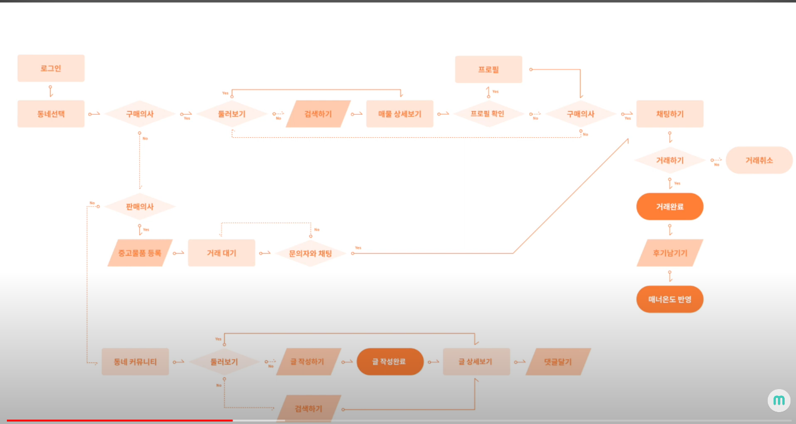
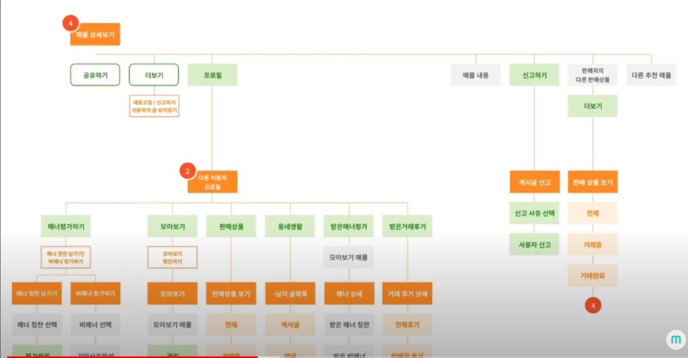
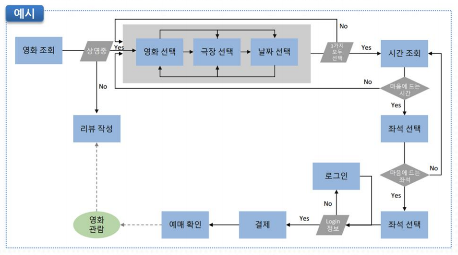
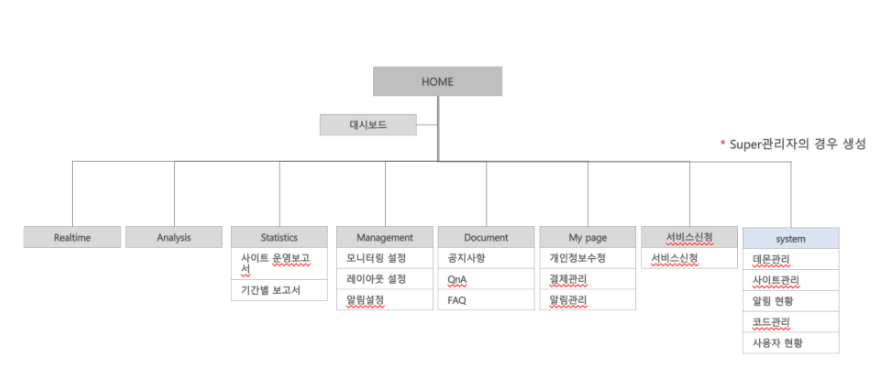
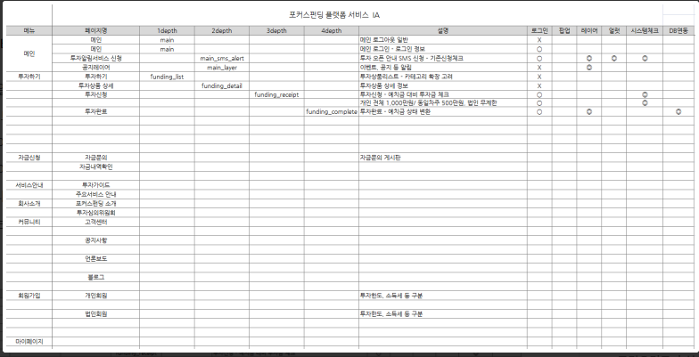
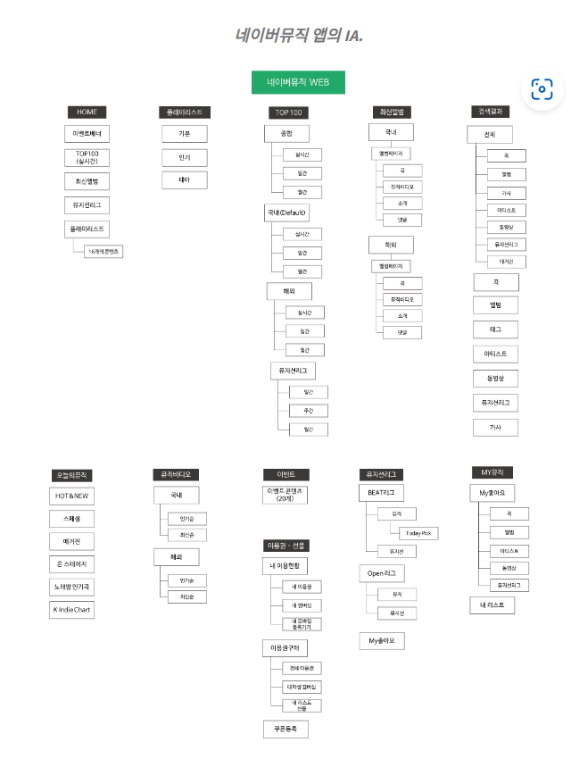
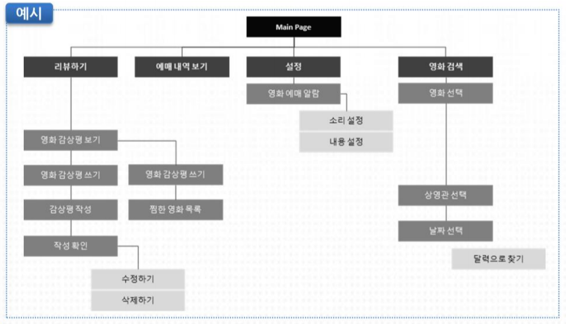

# 2022.12.13(화)

# ✍️ 파이널 프로젝트 - 기획단계

---

개발에 앞서, 기획단계에서 주제선정은 대략적으로 끝이 났다. 

선정된 주제를 가지고 서비스를 어떻게 구체적으로 작동시킬것인지 확장을 시켜야하는데, 기능을 무작정 나열해놓거나 회의을 해도 정확히 눈에 보이는 전체적인 흐름이 없다보니 의사소통 하기도 어렵고 보완하고 추가할 부분들이 정리가 되지 않았다.

강사님께서는 주제가 선정 되었으면 요구사항분석을 통해 유저 시나리오를 꼼꼼히 작성해야 한다고 하셨다.

그러나 유저 시나리오를 꼼꼼히 체크하려면, 화면설계도 어느정도는 되어있어야 했다. 따라서 우리조는 Task Flow를 작성해가면서 부족한 기능을 채워나가고 화면설계도 같이 진행하려 한다.

아래에 기술할 개념들은 사실 개발자의 업무영역은 아니고 PM이나 디자이너가 다룰 개념들이라지만 프로젝트를 처음부터 기획하려면 꼭 필요한 과정이다.

---

### 🖤1. Task Flow (유저 시나리오)

- 사용자가 제품, 또는 서버를 사용하여 과업을 달성할 때 까지 일련의 과정

단일한 플로우로, 모든 사용자들에 의해 특정한 액션으로 유사하게 수행된다. **회원가입**과 같은 테스크를 예로 들수 있다.

Start Point , End Point 설정.

전체 task 안에서 세부 task 별로 별도의 task flow를 작성할 수 있기 때문에 시작점과 끝점을 정의해주어야 한다.

---

### 💚2. User Flow

- 유저 플로우와 테스크 플로우 의 차이점:

 User Flow가 유저의 특정한 journey에 집중하는 반면 Task flows는 싱글 테스크에 집중한다. 

예를들어 스크램블에그를 만든다고 가정했을때, 계란을 깨서 섞고,  프라이팬에 중불로 가열해서 버터를 넣고 계란을 볶아주면 그것이 task flow

그런데 거기에 유저라는 변수가 들어가면 user flow.

스크램블 에그를 만드는데 계란이 없다면? 유통기한이 지났다면? 프라이팬이 없다면? (task flow보다 훨씬 복잡하다. 유저의 결정을 다 고려해야하기 때문)

---

### 💜3. 정보 구조도 (IA)

- 화면상의 노출되는 기능들을 계층적으로 표현한 문서

예시1) 정석적인 구조도

예시2) 엑셀로 작성

